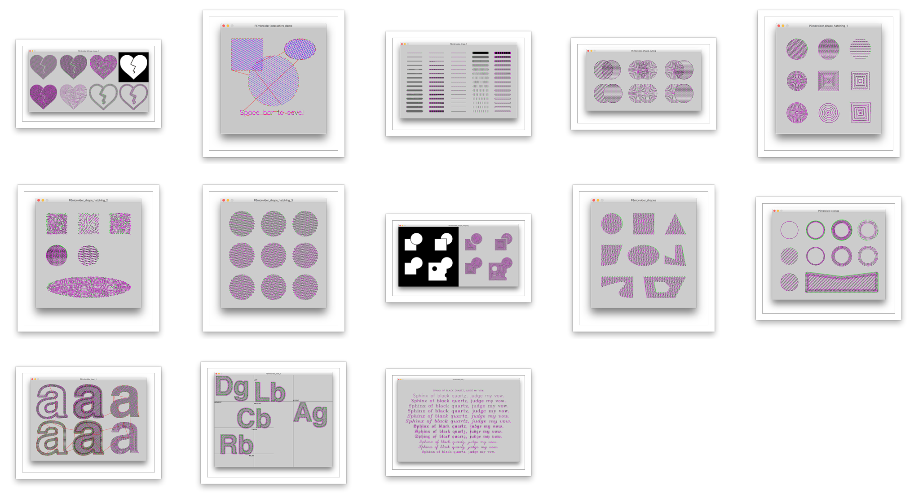
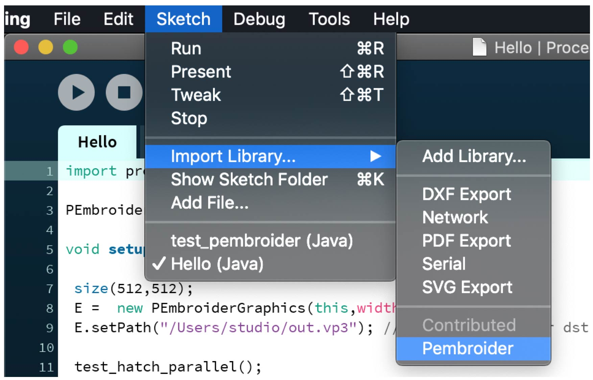
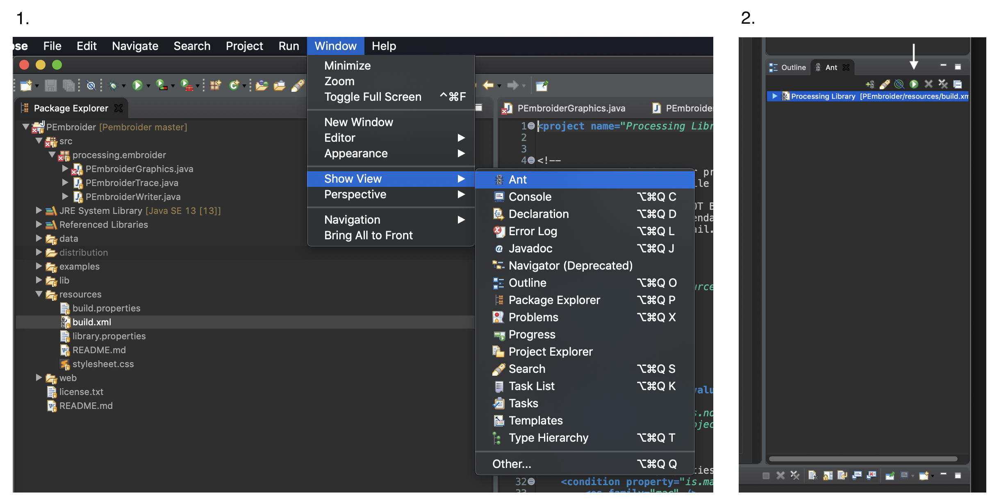

# PEmbroider

**PEmbroider is an open library for computational embroidery with [Processing](http://processing.org).** PEmbroider was developed spring 2020 at the CMU [Frank-Ratchye STUDIO for Creative Inquiry](http://studioforcreativeinquiry.org) by Golan Levin, Lingdong Huang, and Tatyana Mustakos, with generous support from the [Clinic for Open Source Arts](https://www.du.edu/ahss/opensourcearts/) (COSA) at the University of Denver. For questions, please contact [Golan Levin](https://twitter.com/golan). If you found this project useful, please consider [making a donation](https://studioforcreativeinquiry.org/donate).

PEmbroider includes file-writing code adapted from the EmbroidePy [EmbroideryIO](https://github.com/EmbroidePy/EmbroideryIO) project, under its MIT License. Additional thanks to Chris Coleman, Huw Messie, Bryce Summers, Lea Albaugh, Dan Moore, the Processing Foundation, and the staff of the STUDIO. PEmbroider is free, open-source software released under an [MIT License](license.txt).

---
## TL;DR

* **Download** the PEmbroider library [**.ZIP file**](distribution/PEmbroider/download/Pembroider.zip)
* Here's a [**Cheat Sheet**](PEmbroider_Cheat_Sheet.md) 
* Browse the [**Examples**](examples/README.md)
* Read the [**Full API**](https://github.com/CreativeInquiry/PEmbroider/blob/master/API.md)

---
## Contents

* [Motivation](#motivation)
* [Features](#features)
* [Examples](#examples)
* [Getting Started with PEmbroider in Processing](#getting-started-with-pembroider-in-processing)
* [How to Build PEmbroider From Source](#how-to-build-pembroider-from-source)
* [FAQ](#faq)

---
## Motivation

As [this comparison of embroidery software](https://en.wikipedia.org/wiki/Comparison_of_embroidery_software) shows, existing software for the creation of custom embroidery designs frequently costs thousands of dollars; is rarely cross-platform; and is almost never open-source. The free and open-source tools which do exist are either full-featured standalone GUI tools (Ink/Stitch, Embroidermodder) or large-scale libraries (EmbroidePy)—neither of which integrate easily with popular "creative coding" toolkits, nor easily allow for the creation of generative and computational designs. 

PEmbroider, by contrast, is a free, cross-platform, open-source, lightweight Java library for generative embroidery design. It integrates with the popular [Processing](http://processing.org) creative coding framework, providing ready access to a vast and diverse [ecosystem](https://processing.org/reference/libraries/) of functionality including high quality typography, live interaction, motion capture, computer vision, GIS cartography, physics simulation, and much more.

---
## Features

PEmbroider is a embroidery library for the Java flavor of the [Processing](http://processing.org) creative coding environment, suitable for generating embroidery designs computationally. PEmbroider has the following features:

* PEmbroider is structured similarly to other alternative renderers for Processing, providing basic drawing functions (lines, shapes, typography, etc.) that have drop-in compatibility with Processing code. 
* PEmbroider is able to generate embroidery files in .DST, .EXP, .JEF, .PEC, .PES, .VP3, and .XXX file formats, suitable for consumer CNC embroidery machines such as those made by Brother or Husqvarna-Viking. PEmbroider is also able to generate .PDF, .SVG, .TSV, and .GCODE files for other output devices such as AxiDraw pen plotters, CNC routers, etc.
* PEmbroider is able to generate embroidery designs from vector (.SVG) and black-and-white bitmap files (.PNG, .GIF). 
* PEmbroider allows a variety of ways of composing shapes (including overlapping, cropping, and merging) using various computer vision and computational geometry algorithms.
* PEmbroider offers a wide range of embroidery hatching (fill) methods.
* PEmbroider generates optimized (shortest) paths using a modified Traveling Salesperson Problem solver, dramatically reducing embroidery time and material use.

PEmbroider has been tested on MacOS 10.13.6+ and Windows 10, using the STUDIO's Husqvarna Viking Designer Jade 35 embroidery [machine](https://github.com/CreativeInquiry/STUDIO-Embroidery-Machine).

*Note: PEmbroider provides a visualization of the embroidery files it generates. However, PEmbroider has no functionality for loading or previewing pre-existing embroidery files. To preview the contents of a .PES, .VP3, or other embroidery file, you will need to use embroidery viewing software, such as [this](https://htmtopdf.herokuapp.com/embroidery/) or [this](http://www.husqvarnaviking.com/en-US/Support/Complimentary-Software).*

---
## Examples

PEmbroider comes with a variety of [examples](examples/README.md) which demonstrate how to achieve different sorts of embroidery effects with lines, shapes, typography, images and more. Here are some of them:

---
## Getting Started with PEmbroider in Processing

*This section is primarily intended for end-users who wish to get started using PEmbroider to make embroidery designs.* 

* Be sure you have already installed [Processing v.3.5.4](http://processing.org) or higher. 
* [Download](https://github.com/CreativeInquiry/PEmbroider/blob/master/distribution/Pembroider/download/Pembroider.zip) the precompiled PEmbroider library .ZIP directly from [here](https://github.com/CreativeInquiry/PEmbroider/blob/master/distribution/Pembroider/download/Pembroider.zip). 
* For an automated install, try using Processing's Contribution Manager. Navigate as follows in the Processing app: *Sketch* → *Import Library* → *PEmbroider*. This will open the Contribution Manager, where you can browse for PEmbroider.
* For a manual install, Unzip the PEmbroider .ZIP file and install it in your Processing *Libraries* directory. More detailed instructions for doing this can be found [here](https://github.com/processing/processing/wiki/How-to-Install-a-Contributed-Library).
* Restart Processing. You should now be able to open and run the included example programs, which you can find inside the PEmbroider directory, or [here](examples/README.md).
* To export embroidery files, make sure that `optimize()` and `endDraw()` are called in your code. The `optimize()` function produces *much, much* more efficient embroidery paths, while `endDraw()` is the code that actually exports the file. Note that `optimize()` may take up to a minute to execute. 
* In the code for your sketch, be sure you have specified the correct file format extension for your embroidery machine. PEmbroider currently supports .DST, .EXP, .JEF, .PEC, .PES, .VP3, and .XXX. If your machine's format is not yet supported, try using [this online converter](https://htmtopdf.herokuapp.com/embroidery/).
* PEmbroider provides the `visualize()` function to view the planned stitches. You can also preview and validate your embroidery files with software such as [this online viewer](https://htmtopdf.herokuapp.com/embroidery/), Husqvarna/Viking [PREMIER+ 2](http://www.husqvarnaviking.com/en-US/Support/Complimentary-Software), or Brother [PE-Design](http://www.brother.com/common/hsm/ped10/ped10trial.html).
* See [here for instructions](https://github.com/CreativeInquiry/STUDIO-Embroidery-Machine) on using the STUDIO's Husqvarna Viking Designer Jade 35 embroidery machine.

---
## How to Build PEmbroider From Source

*This section is primarily intended for developers who wish to modify, extend, or contribute to the PEmbroider library itself.* 

To compile the library from source: First, open the project in Eclipse; then:

Follow this excerpt from [processing/processing-library-template](https://github.com/processing/processing-library-template):
 
> * From the Eclipse menu bar, choose *Window* → *Show View* → *Ant*. A tab with the title "Ant" will pop up on the right side of your Eclipse editor.
> * Drag the `resources/build.xml` file in there, and a new item "ProcessingLibs" will appear.
> * Press the "Play" button inside the "Ant" tab.
> 
> If BUILD SUCCESSFUL: The Library template will start to compile, control messages will appear in the console window, warnings can be ignored. When finished it should say BUILD SUCCESSFUL. Congratulations, you're set and you can start modifying the library by making changes to the source code in the `src` directory.
> 
> If BUILD FAILED: In case the compile process fails, check the output in the console, which will give you a closer idea of what went wrong. Errors may have been caused by Incorrect path settings in the `build.properties` file.

Here are the same steps, in screenshots:

If there are any issues, download a fresh copy of this repository, and try carefully following [Processing's official documentation](https://github.com/processing/processing-library-template).

---
## FAQ

* **Which output file formats are supported?** .DST, .EXP, .JEF, .PEC, .PES, .VP3, and .XXX, as well as .PDF, .SVG, .TSV, and .GCODE.
* **Which embroidery machine do you recommend?** We cannot recommend which hardware is best for you. However, [this review website](https://bestreviews.com/best-embroidery-machines) has good things to say about the Janome Memory Craft 9850 ($1800, takes .JEF) and the Brother PE800 ($900, takes .PES and .DST). We developed our code using the Viking Jade 35 ($1000) and are pleased. The majority of our beta-testers have different kinds of Brother machines.
* **Why can't PEmbroider read pre-existing embroidery design files?** This is a purposeful limitation of the project's scope. Philosophically, PEmbroider is intended to do one thing well: to allow you to generate new embroidery designs, with code. There is already plenty of software that allows you to load other people's designs. If you would like to manipulate pre-existing embroidery files computationally, we recommend the [EmbroidePy](https://github.com/EmbroidePy/) project.
* **How can I learn to code in Processing?** There's great documentation at the main [Processing website](http://processing.org), or you can check out Dan Shiffman's amazing [Coding Train](https://www.youtube.com/channel/UCvjgXvBlbQiydffZU7m1_aw) tutorials on YouTube. 
* **How can I learn to do machine embroidery?** Here are YouTube tutorials for the [Viking Jade 35](https://www.youtube.com/watch?v=h_uhV8DiyXI), the [Brother PE800](https://www.youtube.com/watch?v=DfpJXuBeEPM), and the [Brother SE600](https://www.youtube.com/watch?v=N0yPILKhHVc).
 